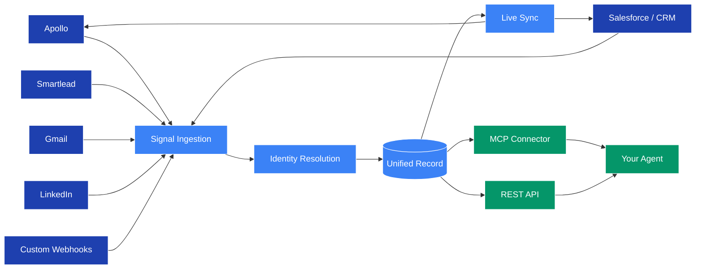

## Architecture

Proply is composed of 3 main services and 5 external signal sources — all 3 main services run within a **single Docker container** and talk to each other directly. Signal sources push data in through OAuth and webhooks; the unified record is exposed to agents via MCP.

* [Signal Ingestion](#signal-ingestion) - Connects to every GTM tool via OAuth, native integrations, and HMAC webhooks. Every event flows in real time.

* [Identity Resolution](#identity-resolution) - Merges every inbound signal into a single record per human. Deduplicates across email, LinkedIn URL, phone, and name+company.

* [Unified Record](#unified-record) - The single source of truth per contact. Holds the full activity timeline, AI-synthesized memory, ICP score, and pipeline state.

* [Live Sync](#live-sync) - Propagates changes back to connected tools. Update a stage in Proply, it updates in Salesforce.

* [MCP Connector](#mcp-connector) - Exposes the unified record to AI agents. One call returns everything: context, timeline, memory, deal stage.

* [REST API](#rest-api) - Full HTTP API for reading and writing from any system or agent framework.

---

### Signal Ingestion

Signal ingestion is how Proply learns about your relationships. It connects to:

* Apollo, Salesforce, HubSpot, Pipedrive — CRM and prospecting data
* Smartlead, Instantly — outbound sequence events
* Gmail, Outlook — email open and reply signals
* LinkedIn via Unipile — connection requests and messages
* RB2B, Signalbase — website visits, intent, funding, and job change signals
* Any HTTP source — custom webhooks with HMAC auth

### Identity Resolution

Identity resolution is what makes Proply a unified layer rather than just another data store. Every inbound signal is matched to a single contact record using:

* Email address
* LinkedIn profile URL
* Phone number
* Name + company matching as a fallback

The same person in Apollo, Salesforce, and Gmail becomes one clean record — not three.

### Unified Record

Each resolved contact has:

* **Activity timeline** - Every email, call, LinkedIn message, CRM update, and sequence event in chronological order
* **Contact memory** - AI-synthesized facts: objections raised, topics discussed, preferences noted
* **Company memory** - Org-level context shared across all contacts at an account
* **ICP score** - How well this contact matches your ideal customer profile, recalculated as signals arrive
* **Pipeline stage** - One of five behavior-driven stages: identified → aware → interested → evaluating → client

### Live Sync

Changes in Proply propagate back to connected tools automatically:

* Update a pipeline stage → syncs to Salesforce or HubSpot
* Enrich a contact → updates Apollo and your CRM
* Your stack stays consistent without manual work

### MCP Connector

The MCP connector is how AI agents read and write to Proply without a UI. Add it to your `mcp.json` and your agent can call tools like `get_contact`, `log_activity`, and `update_pipeline_stage` directly.

### REST API

Full HTTP API for any language or agent framework. Read contacts, write memory, query the pipeline, and manage integrations programmatically.
