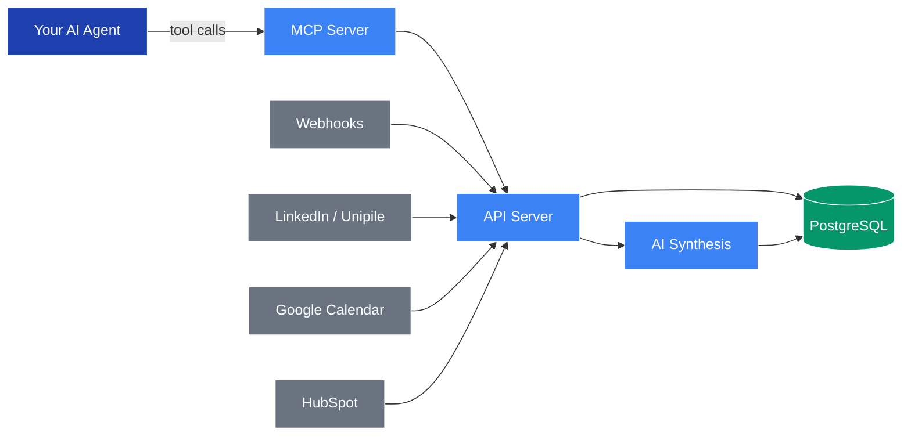

## Architecture

Proply is composed of three main layers: an **API server** that handles all read/write operations, an **MCP server** that exposes tools directly to AI agents, and a **signal ingestion layer** that collects relationship signals from connected providers.

All three layers run within a single Docker container and share a PostgreSQL database. Signals from external services flow in through provider integrations and webhooks; AI synthesis runs on the signal stream and writes structured memory back to the database.

* [API Server](#api-server) — The core service. Handles all CRUD for contacts, companies, memory, activities, and pipeline state.

* [MCP Server](#mcp-server) — Exposes a structured tool surface that AI agents call directly. No UI required.

* [AI Synthesis](#ai-synthesis) — Reads the raw activity log and writes structured memory summaries back to each contact and company record.

* [Signal Providers](#signal-providers) — LinkedIn, Google Calendar, HubSpot, and custom webhooks that feed the activity stream.

* [PostgreSQL](#postgresql) — Single source of truth for all contacts, memory, pipeline state, and activity history.

---

### API Server

The API server is the brain of Proply. It provides a REST API consumed by the MCP server, the web UI, and any direct integrations. All contact reads and writes, memory updates, pipeline stage transitions, and activity logging flow through here.

### MCP Server

The MCP server is how AI agents interact with Proply. It exposes ten core tools:

| Tool | What it does |
|---|---|
| `get_contact` | Read full contact record and memory for a given contact |
| `get_company_memory` | Read org-level memory shared across all contacts at a company |
| `log_activity` | Write an activity event to the contact signal stream |
| `update_pipeline_stage` | Move a contact through the 5-stage pipeline |
| `create_contact` | Add a new contact to the workspace |
| `search_contacts` | Fuzzy search contacts by name, email, or company |
| `get_pipeline` | Read the full pipeline with stage counts and recent activity |
| `draft_proposal` | Trigger AI-powered proposal generation for a contact |
| `get_workspace_context` | Read workspace-level settings and active integrations |
| `list_recent_activity` | Fetch the most recent signals across all contacts |

### AI Synthesis

After each activity event is logged, Proply runs an AI synthesis pass over the raw signal stream and writes a structured summary back to the contact or company memory record. This means your agents always read clean, synthesized context — not a raw event log.

### Signal Providers

Proply collects relationship signals from:

* **LinkedIn** (via Unipile) — Connection requests, messages, and profile visits
* **Google Calendar** — Meetings, rescheduled calls, and no-shows
* **HubSpot** — One-time bootstrap import of existing CRM data
* **Webhooks** — Any custom signal source via an authenticated HMAC webhook endpoint

### PostgreSQL

All data is stored in a single PostgreSQL database. The schema is organized around four core entities:

* **Contacts** — Individual people with associated memory, activities, and pipeline state
* **Companies** — Org-level entities with shared memory across all contacts
* **Activities** — The full event log, tagged by source (email, LinkedIn, calendar, webhook)
* **Memories** — Structured AI-synthesized summaries, tagged to a contact or company

---

## Pipeline stages

Proply uses five behavior-driven stages rather than arbitrary CRM labels. Stage transitions are triggered by observed activity signals, not manual clicks.

| Stage | Meaning | Typical signal |
|---|---|---|
| **Identified** | Contact exists, no interaction yet | Profile visit, list import |
| **Aware** | First contact made | LinkedIn connection, cold email sent |
| **Interested** | Engagement observed | Reply received, meeting booked |
| **Evaluating** | Active consideration | Proposal viewed, follow-up meetings |
| **Client** | Deal closed | Contract signed, invoice paid |

Contacts that go silent decay back toward earlier stages automatically based on configurable time rules.
