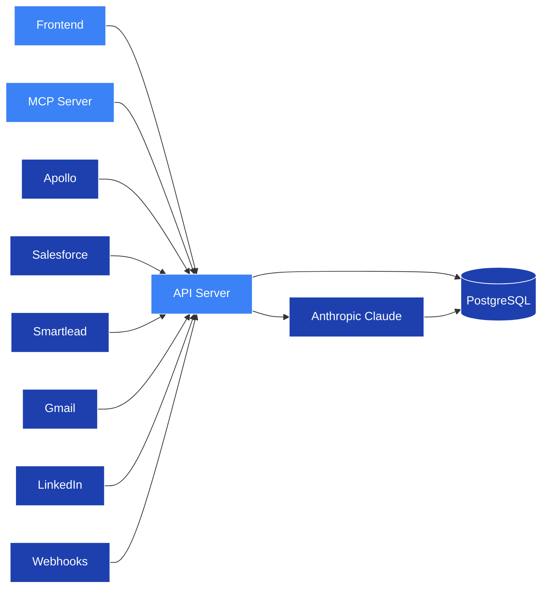

## Architecture

Proply is composed of 3 main services and 2 external dependencies — all 3 main services run within a **single Docker container** and talk to each other directly. They connect to external services for storage and AI synthesis.

* [Frontend](#frontend) - The web UI. Talks to the API server.

* [API Server](#api-server) - Does all the real work. Handles identity resolution, signal ingestion, memory writes, and pipeline state. Provides the REST API for the frontend and MCP server.

* [MCP Server](#mcp-server) - The agent interface. Exposes structured tools that AI agents call directly to read and write account context.

* [PostgreSQL](#postgresql) - Single source of truth. Stores all contacts, companies, memories, activities, and pipeline state via Supabase.

* [Anthropic Claude](#anthropic-claude) - Runs AI synthesis after each signal ingestion. Reads the raw activity stream and writes structured memory summaries back to the database.

---

### Frontend

The frontend is the web interface built with Vite and React. It relies on the API server to:

* Display the contact timeline and person graph
* Show pipeline stages and ICP scores
* Manage integrations and API keys

### API Server

The API server is the brain of Proply. It coordinates all the work:

* Ingesting signals from connected GTM tools (Apollo, Salesforce, Smartlead, Gmail, LinkedIn, webhooks)
* Running identity resolution to merge signals into a single record per human
* Triggering AI synthesis after each new signal
* Serving the REST API for the frontend and MCP server
* Propagating updates back to connected CRM tools via live sync

### MCP Server

The MCP server is how AI agents interact with Proply without a UI. It exposes tools your agent calls directly:

* **get_contact** - Read full contact record, memory, and timeline
* **get_company_memory** - Read org-level context shared across all contacts at an account
* **log_activity** - Write a signal event to the contact stream
* **update_pipeline_stage** - Move a contact through the 5-stage pipeline
* **search_contacts** - Fuzzy search by name, email, or company
* **draft_proposal** - Trigger AI-powered proposal generation

### PostgreSQL

All data is stored in PostgreSQL via Supabase with pgvector for semantic search. The schema has four core tables:

* **contacts** - Individual people with pipeline state and ICP score
* **companies** - Org-level entities with shared memory
* **contact_activity_log** - The full signal event log, tagged by source
* **workspace_memories** - AI-synthesized memory summaries per contact and company

### Anthropic Claude

After each signal event is ingested, Proply triggers a Claude synthesis pass. Claude reads the raw activity log and writes a structured summary back to the contact or company memory record — so agents always read clean, synthesized context, not a raw event stream.
